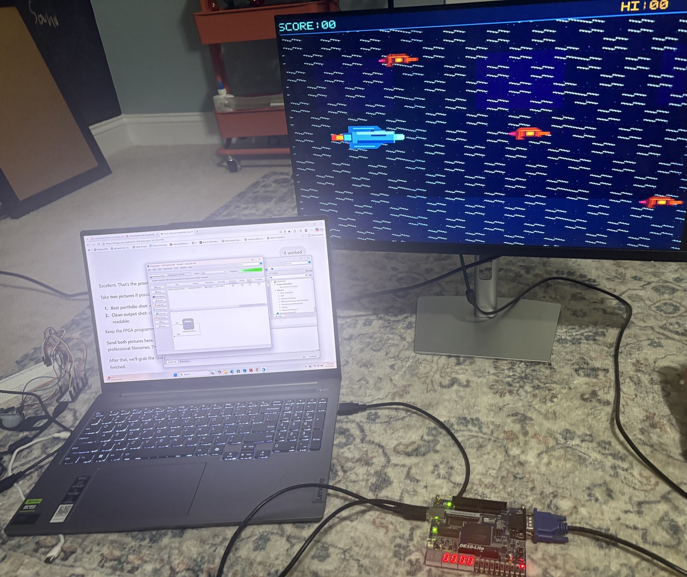

# FalconRT — FPGA Graphics & Game System

FalconRT is a modular FPGA-based graphics and game system implemented in Verilog and deployed on the Intel DE10-Lite (MAX 10) FPGA platform. The project explores real-time VGA video generation, sprite rendering, finite-state-machine control, digital timing, and hardware-driven game logic using synthesizable RTL.

Unlike a software-rendered game, FalconRT generates its graphics and controls its game behavior directly in FPGA hardware. The completed design was synthesized in Intel Quartus Prime, programmed onto the DE10-Lite, and demonstrated through live VGA output.

## Architecture

```text
+------------------+
|  Clock Divider   |
+--------+---------+
         |
         v
+------------------+
|  VGA Controller  |
| Timing / Sync    |
+--------+---------+
         |
         v
+------------------+
|  Game FSM        |
| State / Control  |
+--------+---------+
         |
         +--------------------------+
         |                          |
         v                          v
+------------------+       +------------------+
| Player Sprite ROM|       | Enemy Sprite ROM |
+--------+---------+       +--------+---------+
         |                          |
         +-------------+------------+
                       |
                       v
              +------------------+
              | Sprite Renderer  |
              +--------+---------+
                       |
                       v
              +------------------+
              |  Color Mapper    |
              +--------+---------+
                       |
                       v
              +------------------+
              | VGA Video Output |
              +------------------+
```

## Features

- FPGA-based real-time graphics generation
- Synthesizable modular Verilog RTL architecture
- VGA timing and synchronization
- Player and enemy sprite ROMs
- Hardware sprite rendering
- Finite-state-machine game control
- Background rendering
- Hardware color mapping
- Clock division and timing control
- Seven-segment display support
- Intel DE10-Lite / MAX 10 FPGA deployment
- Direct VGA hardware output
- Fully hardware-driven graphics pipeline

## RTL Modules

| Module | Function |
| --- | --- |
| `falconrt_top.v` | Top-level system integration |
| `vga_controller.v` | Generates VGA timing and synchronization signals |
| `sprite_renderer.v` | Handles sprite positioning and pixel rendering |
| `player_sprite_rom.v` | Stores player sprite pixel data |
| `enemy_sprite_rom.v` | Stores enemy sprite pixel data |
| `background_renderer.v` | Generates the background graphics |
| `game_fsm.v` | Implements game-state and control logic |
| `color_mapper.v` | Maps internal pixel information to display colors |
| `clock_divider.v` | Generates timing signals from the FPGA clock |
| `seven_segment_decoder.v` | Drives seven-segment display outputs |
| `falcon_register.v` | Stores game/system state |

## Hardware Implementation

FalconRT was synthesized and deployed on an Intel DE10-Lite development board featuring the MAX 10 FPGA.

The FPGA directly generates the VGA synchronization, pixel, sprite, background, and game-control logic required to produce the display output.

### FPGA Hardware Demonstration



The image above shows the synthesized FalconRT design running on the physical DE10-Lite FPGA and driving the game display through VGA.

### Live Demonstration

A video of FalconRT operating on the FPGA is included in the repository:

[View FalconRT FPGA Demo](falconrt_fpga_demo.mov)

The demonstration provides physical verification that the synthesized RTL executes on the target FPGA and produces real-time VGA graphics output.

## Engineering Focus

FalconRT was developed to strengthen practical understanding of:

- RTL design
- FPGA graphics pipelines
- Synchronous digital systems
- VGA video timing
- Finite-state machines
- Sprite-based rendering
- Modular hardware architecture
- Hardware debugging
- FPGA synthesis and implementation
- Physical FPGA deployment and verification

## Tools & Technologies

- Verilog HDL
- Intel Quartus Prime
- Intel DE10-Lite
- Intel MAX 10 FPGA
- RTL design
- Digital logic
- VGA graphics
- Finite-state machines
- Hardware timing and synchronization

## Repository Structure

```text
FalconRT/
├── background_renderer.v
├── clock_divider.v
├── color_mapper.v
├── enemy_sprite_rom.v
├── falcon_register.v
├── falconrt_top.v
├── game_fsm.v
├── player_sprite_rom.v
├── seven_segment_decoder.v
├── sprite_renderer.v
├── vga_controller.v
├── falconrt_fpga_demo.jpg
├── falconrt_fpga_demo.mov
└── README.md
```

## Verification

The completed RTL design was synthesized using Intel Quartus Prime and programmed onto the DE10-Lite FPGA.

Hardware testing verified:

- Successful FPGA configuration
- VGA synchronization and video generation
- Background rendering
- Player sprite rendering
- Enemy sprite rendering
- Game-state/control operation
- Physical VGA output to an external display

The hardware demonstration above provides end-to-end verification from synthesizable Verilog RTL to physical FPGA execution and VGA output.

## Future Improvements

Potential extensions include:

- Additional game states and gameplay mechanics
- More sprite types and animation frames
- Collision-detection enhancements
- Expanded score and status displays
- Audio output
- Additional controller/input integration
- Frame-buffer or memory-backed graphics
- Expanded simulation and automated verification
- FPGA timing and resource-utilization optimization

## What I Learned

This project strengthened my understanding of real-time digital graphics, hardware timing, modular RTL design, finite-state-machine control, sprite rendering, and FPGA-based system integration.

It also provided hands-on experience taking a digital system from Verilog RTL through synthesis and FPGA programming to a working physical hardware demonstration.

---

**Author:** Aditya Namdev  
Computer Engineering — Virginia Tech
